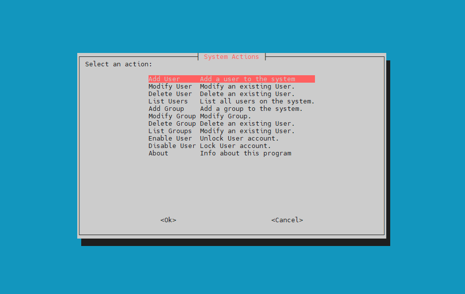

# 🧩 User & Group Management Shell Project

## 📘 Overview
This project is a **Bash-based user and group management system** that provides a menu-driven interface using **whiptail**.  
It allows system administrators to easily manage users and groups through a simple terminal GUI.

---

## 🚀 Features

✅ **User Management**
- Add new users (with random secure passwords)
- Modify existing users
- Delete users
- List all system users
- Lock/Unlock user accounts

✅ **Group Management**
- Add, modify, or delete groups
- List existing groups

✅ **Safety Checks**
- Prevents duplicate usernames
- Validates input parameters
- Displays error messages for invalid actions

---

## 🧰 Requirements

Make sure the following packages are installed:

```bash
sudo apt install whiptail openssl passwd
🏗️ Project Structure
├── main.sh               # Main menu script (entry point)
├── adduser               # Script to add users
├── del_user              # Script to delete users
├── list_users            # Script to list all users
├── add_group             # Script to add groups
├── del_group             # Script to delete groups
├── list_groups           # Script to list all groups
├── Lock_account          # Script to disable user
├── Unlock_account        # Script to enable user

💡 Usage
bash main.sh

└── README.md             # Documentation file
## 📸 Screenshots

### 🧭 Main Menu


### ➕ Add User Window


